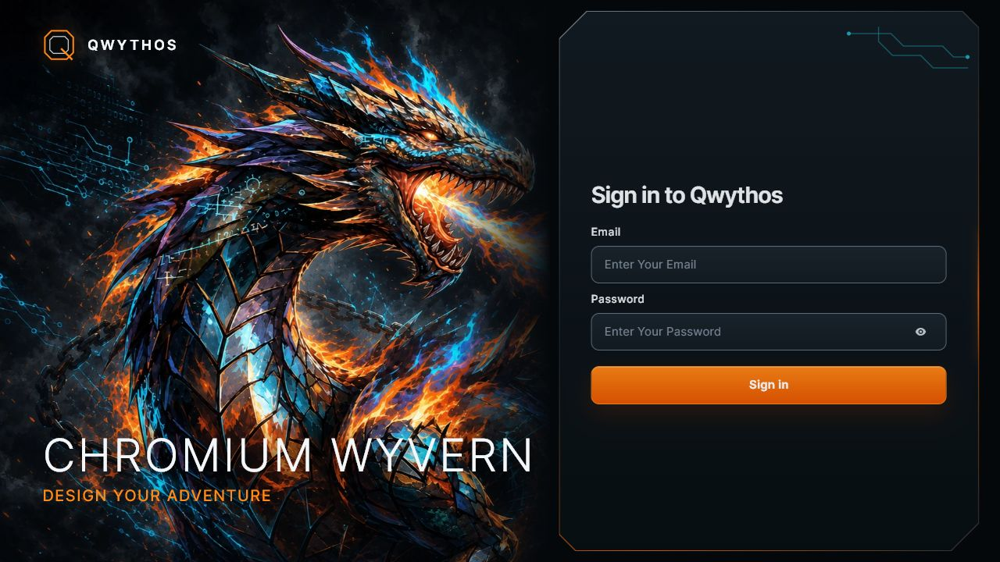
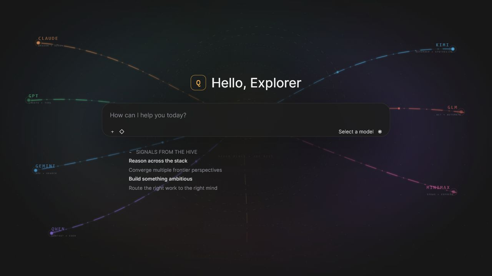

# Qwythos 👋




**Qwythos is an extensible, self-hosted AI workspace designed to run with local Ollama models and OpenAI-compatible APIs.** This private fork adds the Chromium Wyvern interface, a Qwythos model-stack animation, and a Python/pywebview Windows launcher while preserving the underlying platform capabilities.

> [!IMPORTANT]
> Qwythos is a customized private fork of Open WebUI and is not affiliated with the official Open
> WebUI project. Read the [fork and provenance notice](./FORK_NOTICE.md) and inherited license terms
> before deploying or distributing a rebranded build.



Start with the [architecture guide](./docs/ARCHITECTURE.md),
[codebase map](./docs/CODEBASE_MAP.md), or
[private publishing guide](./docs/PUBLISHING_GUIDE.md).

## Key Features of Qwythos ⭐

- 🚀 **Effortless Setup**: Install seamlessly via pip, uv, Docker, or Kubernetes (kubectl, kustomize, or helm), with `:ollama` and `:cuda` tagged images available for container deployments.

- 🤝 **Broad Model & API Integration**: Paste one **OpenRouter** key for chat, embeddings, speech, and images. Additional OpenAI-compatible APIs and local Ollama models remain available under Connections → Advanced.

- 🔐 **Granular RBAC & User Groups**: Administrators define detailed roles, groups, and permissions, giving each user exactly the access they need. Secure by default, with tailored experiences per group.

- 🧩 **Plugin Support**: Extend Qwythos with **Filters**, **Actions**, **Pipes**, **Tools**, and **Skills**. Connect external services through **MCP**, **MCPO**, and **OpenAPI tool servers**. Build custom integrations, rate limits, approval flows, data connections, and more.

- 🤖 **Models & Agents**: Wrap any base model with custom instructions, tools, and knowledge to build specialized agents. Supports dynamic variables, per-user/group access control, and community preset imports via [Qwythos Community](https://qwythos.com/).

- 📝 **Notes**: A dedicated workspace for content outside conversations. Draft with a rich editor, use AI to rewrite selected text, and attach notes to any chat for full-context injection.

- 📢 **Channels**: Real-time shared spaces where your team and AI models collaborate in one timeline. Tag models to draft or critique, with threads, reactions, pins, and access control.

- 🧠 **Persistent Memory**: The AI remembers facts about you across conversations, carrying context from one chat to the next.

- ✅ **Live Workflow & Message Flow**: Watch the AI build and work through checklists in real time. Queue messages while the AI is still responding; they send automatically when it's ready.

- 📅 **Calendar & AI Scheduling**: Built-in personal and shared calendars with month/week/day views, recurring events, color coding, attendees, and reminders. Models manage your schedule conversationally through native function calling.

- ⏱️ **Automations**: Schedule prompts to run on recurring schedules, with runs surfaced on your calendar and each completed run linking back to the chat it produced.

- 📱 **Responsive Design & PWA**: Seamless experience across desktop, laptop, and mobile, with a Progressive Web App for native app-like feel and offline access on localhost.

- ✒️🔢 **Full Markdown and LaTeX Support**: Comprehensive Markdown and LaTeX capabilities for enriched interaction.

- 🎤📹 **Hands-Free Voice/Video Call**: Integrated voice and video calls with multiple Speech-to-Text providers (Local Whisper, OpenAI, Deepgram, Azure) and Text-to-Speech engines (Azure, ElevenLabs, OpenAI, Transformers, WebAPI).

- 💾 **Persistent Artifact Storage**: Built-in key-value storage API for artifacts, enabling journals, trackers, leaderboards, and collaborative tools with personal and shared data scopes.

- 📚 **Local RAG Integration**: Retrieval Augmented Generation backed by pluggable vector stores and multiple content-extraction engines (Tika, Docling, Document Intelligence, Mistral OCR, PaddleOCR-vl, external loaders). Supports hybrid search (BM25 + vector) with reranking and full-context mode. Load documents into chat or pull them from your library with the `#` command.

- 🔍 **Web Search for RAG**: Search the web through dozens of providers including `SearXNG`, `Google PSE`, `Brave Search`, `Kagi`, `Mojeek`, `Tavily`, `Perplexity`, `Firecrawl`, `serpstack`, `serper`, `Serply`, `DuckDuckGo`, `SearchApi`, `SerpApi`, `Bing`, `Jina`, `Exa`, `Sougou`, `Azure AI Search`, and `Ollama Cloud`, injecting results directly into the conversation.

- 🌐 **Web Browsing Capability**: Pull websites into chat with the `#` command followed by a URL, or let the model fetch them on its own when needed.

- 🎨 **Image Generation & Editing**: Create and edit images with multiple engines including OpenAI DALL·E, Gemini, ComfyUI (local), and AUTOMATIC1111 (local), supporting both generation and prompt-based editing.

- ⚙️ **Multi-Model Conversations**: Engage several models at once, harnessing their individual strengths in parallel for the best possible responses.

- 📊 **Usage Analytics & Model Evaluation**: Admin dashboards track message volume, token consumption, and cost across users and models. Evaluate models with a built-in arena, A/B testing, and ELO-based leaderboards.

- 🗄️ **Flexible Database & Storage**: Choose SQLite (with optional encryption) or PostgreSQL, and store files locally or on S3, Google Cloud Storage, or Azure Blob Storage.

- 🧬 **Advanced Vector Database Support**: Fifteen backend modules cover ChromaDB, PGVector, Qdrant, Milvus, Elasticsearch, OpenSearch, Pinecone, S3Vector, Oracle 23ai, MariaDB Vector, openGauss, Weaviate, and Valkey, including Qdrant and Milvus multitenancy variants.

- 🪪 **Enterprise Authentication & Provisioning**: Full LDAP/Active Directory integration, SSO via trusted headers and OAuth providers, and SCIM 2.0 automated provisioning for identity providers like Okta, Azure AD, and Google Workspace.

- ☁️ **Cloud-Native File Integration**: Native Google Drive and OneDrive/SharePoint file picking for seamless document import from enterprise cloud storage.

- 🔭 **Production Observability**: Built-in OpenTelemetry support for traces, metrics, and logs, plugging into your existing monitoring stack.

- ⚖️ **Horizontal Scalability**: Redis-backed session management and WebSocket support for multi-worker, multi-node deployments behind load balancers.

- 🌐🌍 **Multilingual Support**: Use Qwythos in your preferred language with i18n support. We're actively seeking contributors to expand language coverage!

- 🌟 **Continuous Updates**: We're committed to improving Qwythos with regular updates, fixes, and new features.

- 🛡️ **Transparent Security Process**: Security reports are triaged, fixed, and published as open advisories through a documented responsible-disclosure process. See our [Security Policy](https://github.com/qwythos/qwythos/security).

Want to learn more about Qwythos's features? Check out our [Qwythos documentation](https://docs.qwythos.com/features) for a comprehensive overview!

## Architecture 🏗️

> **理 · 想 · 合** — _Reason · Imagine · Converge_ — **Seven Minds · One Hive · Infinite Context**

Qwythos is a full-stack platform built on two primary pillars:

| Layer                 | Stack                                               | Scale                                                                    |
| --------------------- | --------------------------------------------------- | ------------------------------------------------------------------------ |
| **Backend**           | Python · FastAPI · SQLAlchemy                       | 31 router modules · 26 model modules · 46 utility modules                |
| **Frontend**          | SvelteKit · Vite · TypeScript                       | 29 API feature directories · 12 component groups · 63 locale directories |
| **RAG Pipeline**      | 15 vector-backend modules · 33 web-search modules   | 10 loader modules · hybrid search                                        |
| **Model connections** | Ollama · OpenAI-compatible APIs · Anthropic adapter | Streaming, tools, filters, and middleware orchestration                  |

📖 **[Full Architecture Documentation →](./docs/ARCHITECTURE.md)** ·
🧭 **[Codebase Map →](./docs/CODEBASE_MAP.md)**

## Runtime Surfaces 🌐

- **Browser / PWA** — the SvelteKit client talks to the FastAPI service over REST and Socket.IO.
- **Windows native window** — [`desktop/launcher.pyw`](./desktop/launcher.pyw) bootstraps the Python environment, and [`desktop/app.py`](./desktop/app.py) hosts the same production UI in pywebview.
- **Container deployments** — the checked-in Docker and Compose files package the frontend and backend for self-hosted use.
- **External model and tool connections** — Ollama, OpenAI-compatible endpoints, Anthropic adaptation, MCP, MCPO, and OpenAPI tool servers feed the shared orchestration path.

## How to Install 🚀

### Windows Chromium Wyvern launcher

Python 3.11 and 3.12 are supported by the package metadata; this workspace is verified with Python 3.12.

```powershell
npm ci
npm run build
powershell -ExecutionPolicy Bypass -File '.\desktop\Create Desktop Shortcut.ps1'
```

Open the new **Qwythos** desktop shortcut. The launcher creates `.venv`, installs the backend and pywebview dependencies on first use, starts a verified local server, and opens the production chatbot UI.

### Quick Start with Docker 🐳

> [!NOTE]  
> Please note that for certain Docker environments, additional configurations might be needed. If you encounter any connection issues, our detailed guide on [Qwythos Documentation](https://docs.qwythos.com/) is ready to assist you.

> [!WARNING]
> When using Docker to install Qwythos, make sure to include the `-v qwythos:/app/backend/data` in your Docker command. This step is crucial as it ensures your database is properly mounted and prevents any loss of data.

> [!TIP]  
> If you wish to utilize Qwythos with Ollama included or CUDA acceleration, we recommend utilizing our official images tagged with either `:cuda` or `:ollama`. To enable CUDA, you must install the [Nvidia CUDA container toolkit](https://docs.nvidia.com/dgx/nvidia-container-runtime-upgrade/) on your Linux/WSL system.

### Installation with Default Configuration

- **If Ollama is on your computer**, use this command:

  ```bash
  docker run -d -p 3000:8080 --add-host=host.docker.internal:host-gateway -v qwythos:/app/backend/data --name qwythos --restart always ghcr.io/qwythos/qwythos:main
  ```

- **If Ollama is on a Different Server**, use this command:

  To connect to Ollama on another server, change the `OLLAMA_BASE_URL` to the server's URL:

  ```bash
  docker run -d -p 3000:8080 -e OLLAMA_BASE_URL=https://example.com -v qwythos:/app/backend/data --name qwythos --restart always ghcr.io/qwythos/qwythos:main
  ```

- **To run Qwythos with Nvidia GPU support**, use this command:

  ```bash
  docker run -d -p 3000:8080 --gpus all --add-host=host.docker.internal:host-gateway -v qwythos:/app/backend/data --name qwythos --restart always ghcr.io/qwythos/qwythos:cuda
  ```

### Installation for OpenAI API Usage Only

- **If you're only using OpenAI API**, use this command:

  ```bash
  docker run -d -p 3000:8080 -e OPENAI_API_KEY=your_secret_key -v qwythos:/app/backend/data --name qwythos --restart always ghcr.io/qwythos/qwythos:main
  ```

### Installing Qwythos with Bundled Ollama Support

This installation method uses a single container image that bundles Qwythos with Ollama, allowing for a streamlined setup via a single command. Choose the appropriate command based on your hardware setup:

- **With GPU Support**:
  Utilize GPU resources by running the following command:

  ```bash
  docker run -d -p 3000:8080 --gpus=all -v ollama:/root/.ollama -v qwythos:/app/backend/data --name qwythos --restart always ghcr.io/qwythos/qwythos:ollama
  ```

- **For CPU Only**:
  If you're not using a GPU, use this command instead:

  ```bash
  docker run -d -p 3000:8080 -v ollama:/root/.ollama -v qwythos:/app/backend/data --name qwythos --restart always ghcr.io/qwythos/qwythos:ollama
  ```

Both commands facilitate a built-in, hassle-free installation of both Qwythos and Ollama, ensuring that you can get everything up and running swiftly.

After installation, you can access Qwythos at [http://localhost:3000](http://localhost:3000). Enjoy! 😄

### Other Installation Methods

We offer various installation alternatives, including non-Docker native installation methods, Docker Compose, Kustomize, and Helm. Visit our [Qwythos Documentation](https://docs.qwythos.com/getting-started/) or join our [Discord community](https://discord.gg/5rJgQTnV4s) for comprehensive guidance.

### Troubleshooting

Encountering connection issues? Our [Qwythos Documentation](https://docs.qwythos.com/troubleshooting/) has got you covered. For further assistance and to join our vibrant community, visit the [Qwythos Discord](https://discord.gg/5rJgQTnV4s).

#### Qwythos: Server Connection Error

If you're experiencing connection issues, it’s often due to the WebUI docker container not being able to reach the Ollama server at 127.0.0.1:11434 (host.docker.internal:11434) inside the container . Use the `--network=host` flag in your docker command to resolve this. Note that the port changes from 3000 to 8080, resulting in the link: `http://localhost:8080`.

**Example Docker Command**:

```bash
docker run -d --network=host -v qwythos:/app/backend/data -e OLLAMA_BASE_URL=http://127.0.0.1:11434 --name qwythos --restart always ghcr.io/qwythos/qwythos:main
```

### Keeping Your Docker Installation Up-to-Date

Check our Updating Guide available in our [Qwythos Documentation](https://docs.qwythos.com/getting-started/updating).

### Using the Dev Branch 🌙

> [!WARNING]
> The `:dev` branch contains the latest unstable features and changes. Use it at your own risk as it may have bugs or incomplete features.

If you want to try out the latest bleeding-edge features and are okay with occasional instability, you can use the `:dev` tag like this:

```bash
docker run -d -p 3000:8080 -v qwythos:/app/backend/data --name qwythos --add-host=host.docker.internal:host-gateway --restart always ghcr.io/qwythos/qwythos:dev
```

### Offline Mode

If you are running Qwythos in an offline environment, you can set the `HF_HUB_OFFLINE` environment variable to `1` to prevent attempts to download models from the internet.

```bash
export HF_HUB_OFFLINE=1
```

## About the Developer 👨‍💻

Learn about the developer behind Qwythos, the technical vision, and the engineering depth of this project.

👤 **[Read the Developer Profile →](./AUTHOR.md)**

## Project Documentation

Use the checked-in [architecture](./docs/ARCHITECTURE.md),
[codebase map](./docs/CODEBASE_MAP.md), and
[private publishing guide](./docs/PUBLISHING_GUIDE.md) as the source of truth for this fork.

## License 📜

This fork contains code under multiple inherited licenses. Current upstream-derived code includes the Open WebUI License's branding condition, while earlier material retains the terms recorded in [LICENSE_HISTORY](./LICENSE_HISTORY). See [LICENSE](./LICENSE), [LICENSE_NOTICE](./LICENSE_NOTICE), [LICENSE_HISTORY](./LICENSE_HISTORY), the [fork notice](./FORK_NOTICE.md), and [third-party notices](./THIRD_PARTY_NOTICES.md) before deployment or redistribution.

## Support 💬

Use the issue tracker and collaborator channels of the private repository that hosts this fork.

## Security 🛡️

Follow [the checked-in security policy](./docs/SECURITY.md) and use a private disclosure channel;
do not place vulnerability details in a public issue.

---

The original codebase and license history credit Timothy Jaeryang Baek. This private fork is
maintained by [John Matukutire](./AUTHOR.md); all inherited notices remain in the license files.
