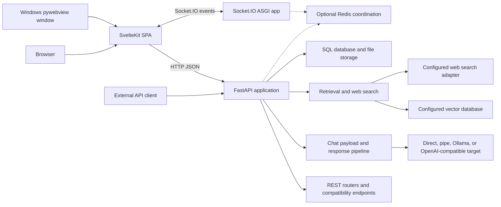
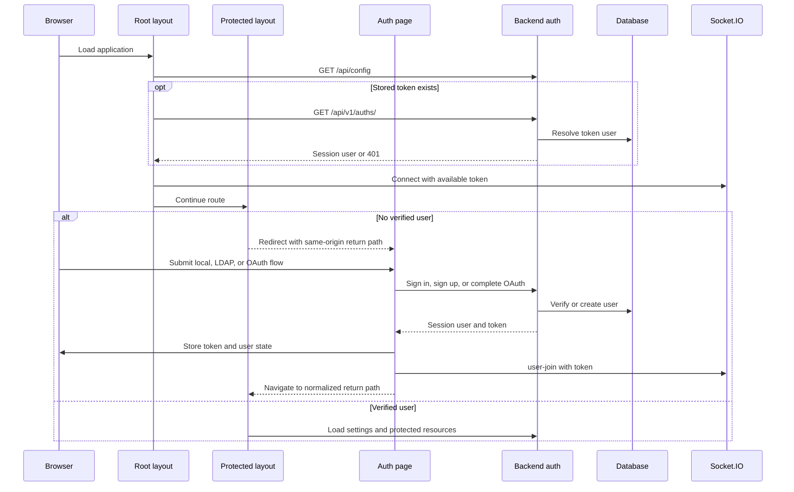
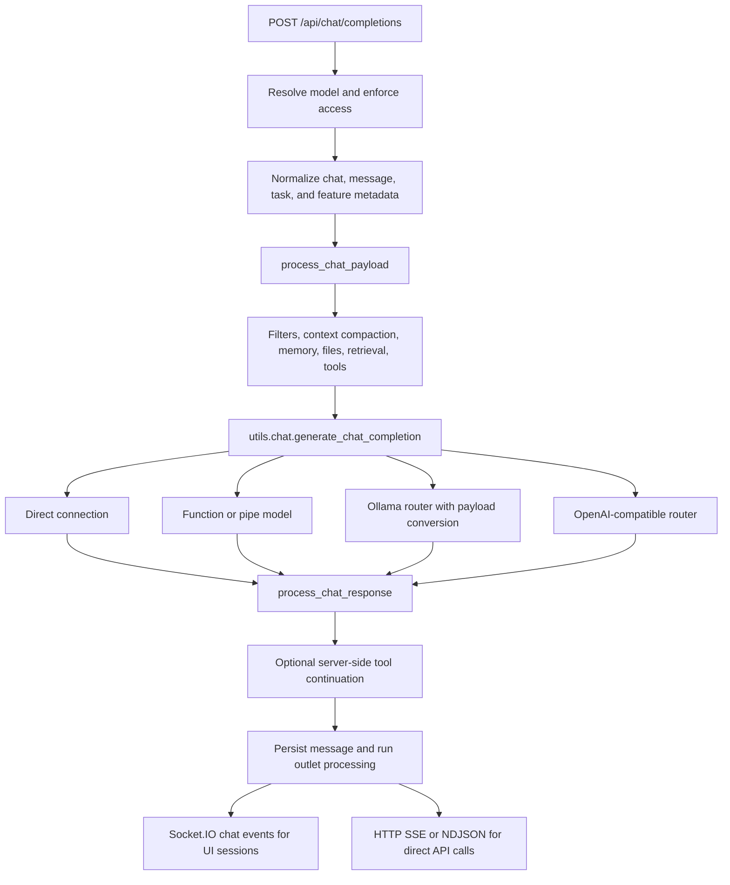
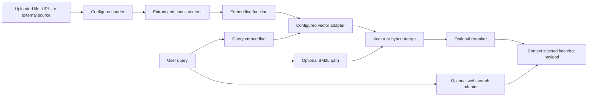
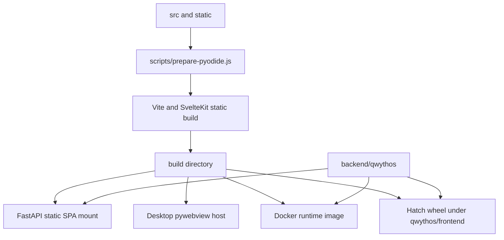
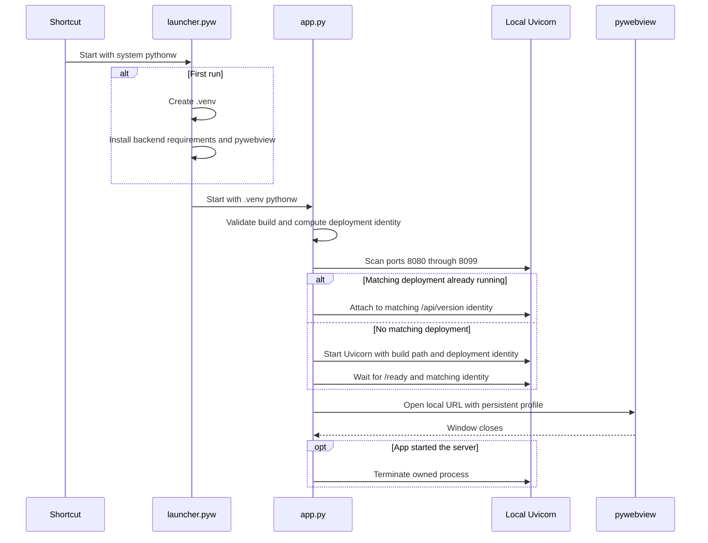

# Qwythos Architecture

This document describes the architecture implemented by this repository. It was verified against the source tree on 2026-08-02. For a task-oriented file index, see the [Codebase Map](CODEBASE_MAP.md).

## Scope and system shape

Qwythos is a client-rendered SvelteKit application backed by a FastAPI ASGI service. The production server and the Windows desktop launcher both serve the same static frontend build. The current desktop implementation is Python plus pywebview; it is not a Tauri application.

The principal runtime boundaries are:

| Boundary     | Implementation                            | Responsibility                                                                                         |
| ------------ | ----------------------------------------- | ------------------------------------------------------------------------------------------------------ |
| Frontend     | [`src/`](../src/)                         | Client-side routing, application state, chat UI, admin/workspace UI, typed API calls, Socket.IO client |
| Backend      | [`backend/qwythos/`](../backend/qwythos/) | ASGI app, auth, API routes, chat orchestration, persistence, retrieval, tools, background work         |
| Desktop host | [`desktop/`](../desktop/)                 | Windows bootstrap, local Uvicorn lifecycle, persistent pywebview profile                               |
| Static build | `build/`                                  | Generated SvelteKit SPA consumed by FastAPI, Docker, the Python wheel, and the desktop host            |
| Runtime data | `backend/data/` by default                | SQLite database, uploads, caches, vector data, logs, desktop webview profile                           |

## Verified source inventory

Counts exclude `__init__.py` unless stated otherwise. These are a source snapshot, not architectural limits.

| Area                          |                      Verified count | Definition                                                                                                                 |
| ----------------------------- | ----------------------------------: | -------------------------------------------------------------------------------------------------------------------------- |
| Backend router modules        |                                  31 | Python files in [`backend/qwythos/routers/`](../backend/qwythos/routers/); analytics and SCIM registration are conditional |
| Backend model modules         |                                  26 | Python files in [`backend/qwythos/models/`](../backend/qwythos/models/)                                                    |
| SQLAlchemy table declarations |                                  38 | `__tablename__` declarations across the model modules                                                                      |
| Backend utility modules       |          46 top-level, 55 recursive | Python files in [`backend/qwythos/utils/`](../backend/qwythos/utils/)                                                      |
| Frontend API clients          | 29 directories, 30 TypeScript files | Subdirectories under [`src/lib/apis/`](../src/lib/apis/) plus the root `index.ts`                                          |
| Frontend components           | 12 directories, 9 root Svelte files | Direct children of [`src/lib/components/`](../src/lib/components/)                                                         |
| SvelteKit routes              |                 47 pages, 8 layouts | `+page.svelte` and `+layout.svelte` files under [`src/routes/`](../src/routes/)                                            |
| Locales                       |                                  63 | Directories under [`src/lib/i18n/locales/`](../src/lib/i18n/locales/)                                                      |
| Retrieval loaders             |                                  10 | Python modules in [`retrieval/loaders/`](../backend/qwythos/retrieval/loaders/)                                            |
| Vector adapters               |    15 modules, 13 database families | Qdrant and Milvus each have a second multitenancy adapter                                                                  |
| Web search adapters           |                                  31 | 33 Python modules in [`retrieval/web/`](../backend/qwythos/retrieval/web/) minus `main.py` and `utils.py`                  |

The 31 router modules are:

`analytics`, `audio`, `auths`, `automations`, `calendar`, `channels`, `chats`, `configs`, `evaluations`, `files`, `folders`, `functions`, `groups`, `images`, `knowledge`, `memories`, `models`, `notes`, `notifications`, `ollama`, `openai`, `pipelines`, `prompts`, `retrieval`, `scim`, `skills`, `tasks`, `terminals`, `tools`, `users`, and `utils`.

## Frontend architecture

[`src/routes/+layout.js`](../src/routes/+layout.js) disables server-side rendering, and [`svelte.config.js`](../svelte.config.js) uses `adapter-static` with `index.html` as the SPA fallback. In development, [`src/lib/constants.ts`](../src/lib/constants.ts) targets the backend at the browser hostname on port 8080. In production it uses same-origin URLs.

### Bootstrap and protected application shell

[`src/routes/+layout.svelte`](../src/routes/+layout.svelte) is the global bootstrap layer. It:

1. fetches public backend configuration from `GET /api/config`;
2. initializes localization and global stores;
3. creates the Socket.IO client at `/ws/socket.io`;
4. restores a user through `GET /api/v1/auths/` when `localStorage.token` exists;
5. handles deployment/version changes, notifications, and global browser events.

[`src/routes/(app)/+layout.svelte`](<../src/routes/(app)/+layout.svelte>) is the protected application shell. It redirects an absent user to `/auth?redirect=...`, then loads settings, models, tools, banners, and tool-server data. [`src/routes/(app)/+page.svelte`](<../src/routes/(app)/+page.svelte>) mounts the main [`Chat.svelte`](../src/lib/components/chat/Chat.svelte) component.

The route groups are organized around:

- protected chat, channels, folders, notes, calendar, automations, playground, admin, and workspace pages under `src/routes/(app)/`;
- authentication at `src/routes/auth/`;
- shared chats at `src/routes/s/[id]/`;
- error and watch pages at `src/routes/error/` and `src/routes/watch/`.

The API client layer mirrors backend domains where useful. It is not a one-to-one mirror: for example, `streaming` and `terminal` are frontend client domains, while backend-only routers such as `pipelines`, `tasks`, and `scim` do not have matching client directories.

## Backend architecture

[`backend/qwythos/main.py`](../backend/qwythos/main.py) creates the FastAPI app and owns the highest-coupling runtime assembly:

- lifespan startup and shutdown;
- middleware registration;
- Socket.IO mount at `/ws`;
- router registration;
- unified chat and compatibility endpoints;
- public configuration, health, readiness, and version endpoints;
- static asset and SPA serving.

API documentation is exposed only when `ENV == "dev"`. The middleware stack includes redirect, security-header, database-session commit, auth-token, WebSocket-upgrade guard, CORS, and configured audit middleware.

### Routes

Most domain APIs are mounted below `/api/v1`. Ollama and OpenAI proxy routers are mounted at `/ollama` and `/openai`. Two router registrations depend on feature flags:

- `analytics.py` is mounted only when `ENABLE_ADMIN_ANALYTICS` is enabled;
- `scim.py` is mounted at `/api/v1/scim/v2` only when `ENABLE_SCIM` is enabled.

The unified model endpoints implemented directly in `main.py` include:

- `POST /api/chat/completions` and compatibility alias `POST /api/v1/chat/completions`;
- `POST /api/message` and compatibility alias `POST /api/v1/messages` for Anthropic Messages format;
- `POST /api/message/count_tokens` and compatibility alias `POST /api/v1/messages/count_tokens`;
- `GET /api/models` and compatibility alias `GET /api/v1/models`.

The Anthropic-format endpoint converts to the internal OpenAI-shaped payload unless the configured connection supports direct Anthropic Messages passthrough.

### Configuration and startup

[`backend/qwythos/env.py`](../backend/qwythos/env.py) resolves process environment, filesystem paths, database URL, deployment identity, and low-level runtime flags. [`backend/qwythos/config.py`](../backend/qwythos/config.py) defines the registered runtime configuration and seeds database-backed defaults through [`models/config.py`](../backend/qwythos/models/config.py).

During lifespan startup, `main.py` imports legacy configuration, seeds defaults, initializes runtime config, optionally creates an admin from environment variables, installs tool/function dependencies, connects optional Redis, starts cleanup and scheduler loops, and may warm model/tool-server caches. `app.state.startup_complete` is set only after this work finishes.

Health endpoints have distinct meanings:

| Endpoint           | Meaning                                                             |
| ------------------ | ------------------------------------------------------------------- |
| `GET /health`      | Process is responding                                               |
| `GET /ready`       | Startup completed, database responds, and configured Redis responds |
| `GET /health/db`   | Database ping succeeds                                              |
| `GET /api/version` | Application version plus deployment identity                        |

### Static frontend serving

When `FRONTEND_BUILD_DIR` exists, FastAPI mounts build assets and finally mounts [`SPAStaticFiles`](../backend/qwythos/main.py) at `/`. Non-JavaScript 404s fall back to `index.html`, preserving SvelteKit client-side routing. If the build directory is absent, the backend logs that it is serving the API only.

## Authentication lifecycle

Backend authentication is centered in [`routers/auths.py`](../backend/qwythos/routers/auths.py) and [`utils/auth.py`](../backend/qwythos/utils/auth.py). Protected dependencies accept a bearer token, token cookie, or middleware-provided API key. JWTs resolve a database user; API keys beginning with `sk-` use the API-key path. `get_verified_user` admits the `user` and `admin` roles.

The first successfully created user is promoted to admin after insertion, and signup is then disabled in persisted configuration. OAuth/OIDC, LDAP, trusted-header auth, and SCIM are configuration-dependent paths rather than separate runtime services.

Redis is not the primary session database. When configured, it supports JWT revocation checks; user identity still resolves from the SQL database. The frontend stores the returned token in `localStorage`, while OAuth completion can initially deliver it through the `token` cookie.

The auth page normalizes redirect targets to same-origin paths and rejects `/auth`, `/error`, protocol-relative paths, and external origins before navigation.

## Chat and model orchestration

The frontend API client in [`src/lib/apis/openai/index.ts`](../src/lib/apis/openai/index.ts) sends chat payloads to `POST /api/chat/completions`. The backend route validates model existence and access, builds chat metadata, and then uses the middleware and provider-dispatch layers.

The important implementation split is:

1. [`main.py`](../backend/qwythos/main.py) owns model access, metadata, fan-out, and task creation.
2. [`utils/middleware.py`](../backend/qwythos/utils/middleware.py) owns payload enrichment, response parsing, tool-call continuation, persistence, events, and outlet filters.
3. [`utils/chat.py`](../backend/qwythos/utils/chat.py) dispatches to direct connections, function/pipe models, Ollama, or the OpenAI-compatible router.
4. [`routers/ollama.py`](../backend/qwythos/routers/ollama.py) and [`routers/openai.py`](../backend/qwythos/routers/openai.py) perform upstream provider communication.

For normal UI chats with a `session_id` and `chat_id`, the endpoint creates background task(s), returns task IDs, and publishes progress/completion through Socket.IO while updating the chat database. For legacy or direct API requests without that UI session metadata, streaming stays on the HTTP response as SSE or NDJSON. Socket.IO therefore is not the only response transport, and HTTP streaming is not the only UI update path.

Multi-model fan-out and the subagent implementation are in-process capabilities, not separately deployed services. Subagent execution lives in [`utils/subagents.py`](../backend/qwythos/utils/subagents.py) and reuses the same chat pipeline.

## Retrieval, search, and knowledge

The retrieval surface is implemented by [`routers/retrieval.py`](../backend/qwythos/routers/retrieval.py) and [`backend/qwythos/retrieval/`](../backend/qwythos/retrieval/).

The ten loader modules are `datalab_marker`, `external_document`, `external_web`, `main`, `microsoft_web_iq`, `mineru`, `mistral`, `paddleocr_vl`, `tavily`, and `youtube`.

[`retrieval/vector/factory.py`](../backend/qwythos/retrieval/vector/factory.py) selects one vector implementation from 13 database families: Chroma, Elasticsearch, MariaDB Vector, Milvus, openGauss, OpenSearch, Oracle 23ai, PGVector, Pinecone, Qdrant, S3 Vector, Valkey, and Weaviate. There are 15 adapter modules because Milvus and Qdrant each include a multitenancy variant. [`retrieval/vector/async_client.py`](../backend/qwythos/retrieval/vector/async_client.py) exposes the synchronous adapter contract through `asyncio.to_thread` for async callers.

Hybrid retrieval is optional. [`retrieval/utils.py`](../backend/qwythos/retrieval/utils.py) can use a backend-native hybrid search when available, otherwise combines BM25 and vector retrieval and can apply a reranker. It falls back to vector retrieval if hybrid processing fails.

The web-search dispatcher has 31 provider adapter modules. Configuration selects one engine for a request; the number of modules does not mean all services are contacted or configured at runtime.

## Persistence and storage

### Relational database

[`backend/qwythos/internal/db.py`](../backend/qwythos/internal/db.py) builds synchronous and asynchronous SQLAlchemy engines and session helpers. [`env.py`](../backend/qwythos/env.py) defaults `DATABASE_URL` to SQLite at `backend/data/webui.db`; PostgreSQL-style URLs are also supported by the engine configuration. Alembic migrations live in [`backend/qwythos/migrations/`](../backend/qwythos/migrations/).

The 26 model modules contain 38 SQLAlchemy table declarations. A module is therefore not equivalent to a table: calendar, channel, chat, group, knowledge, message, note, and automation modules each define multiple tables.

### File storage

[`backend/qwythos/storage/provider.py`](../backend/qwythos/storage/provider.py) selects one provider at import time from:

- local filesystem;
- Amazon S3 or an S3-compatible endpoint;
- Google Cloud Storage;
- Azure Blob Storage.

Cloud uploads are staged through the local upload directory, and cloud reads are downloaded to that directory before callers receive a local path.

### Redis

Redis is optional. Source-backed uses include distributed task commands/state, Socket.IO coordination, WebSocket model/session/usage pools, selected caches, and JWT revocation. The Redis helper supports standalone, Sentinel, and Cluster connection modes. Without Redis, task and Socket.IO state use in-process dictionaries and managers, which is suitable only for a single process boundary.

## Real-time and scheduled work

[`backend/qwythos/socket/main.py`](../backend/qwythos/socket/main.py) creates the Socket.IO server. The FastAPI app mounts its ASGI application at `/ws`, while the frontend and Socket.IO configuration use `/ws/socket.io` as the client path. The socket layer handles authenticated user and channel rooms, chat events, presence/usage state, note/document collaboration, and notifications.

When `WEBSOCKET_MANAGER == "redis"`, Socket.IO uses `AsyncRedisManager` and Redis-backed shared pools. Otherwise it uses the default in-memory manager.

Background tasks are tracked by [`backend/qwythos/tasks.py`](../backend/qwythos/tasks.py), with Redis-backed coordination when Redis exists and in-memory tracking otherwise. Scheduled automation, calendar-alert, and timer work is a custom async polling loop in [`utils/automations.py`](../backend/qwythos/utils/automations.py); it is not an APScheduler service.

## Tools, functions, and extensibility

The extensibility surface spans several related but distinct concepts:

| Concept                                          | Primary implementation                                                                                                                                                              |
| ------------------------------------------------ | ----------------------------------------------------------------------------------------------------------------------------------------------------------------------------------- |
| Built-in model-callable tools                    | [`tools/builtin.py`](../backend/qwythos/tools/builtin.py)                                                                                                                           |
| Knowledge filesystem tool                        | [`tools/knowledge_fs.py`](../backend/qwythos/tools/knowledge_fs.py)                                                                                                                 |
| Tool discovery/execution and remote server specs | [`utils/tools.py`](../backend/qwythos/utils/tools.py)                                                                                                                               |
| MCP client                                       | [`utils/mcp/client.py`](../backend/qwythos/utils/mcp/client.py)                                                                                                                     |
| User functions and filters                       | [`routers/functions.py`](../backend/qwythos/routers/functions.py), [`utils/plugin.py`](../backend/qwythos/utils/plugin.py), [`utils/filter.py`](../backend/qwythos/utils/filter.py) |
| Skills                                           | [`routers/skills.py`](../backend/qwythos/routers/skills.py), [`models/skills.py`](../backend/qwythos/models/skills.py)                                                              |
| Subagents                                        | [`utils/subagents.py`](../backend/qwythos/utils/subagents.py)                                                                                                                       |
| Terminal tool servers                            | [`routers/terminals.py`](../backend/qwythos/routers/terminals.py), [`utils/terminals.py`](../backend/qwythos/utils/terminals.py)                                                    |

These capabilities execute inside or are invoked from the chat pipeline. They should not be modeled as independent network services unless an external tool, MCP, OpenAPI, or terminal server is actually configured.

## Build and deployment flows

### Frontend build

[`package.json`](../package.json) defines `npm run dev`, `npm run build`, type checking, formatting, linting, and frontend tests. Both dev and build first run [`scripts/prepare-pyodide.js`](../scripts/prepare-pyodide.js), which prepares browser-side Pyodide assets. [`vite.config.ts`](../vite.config.ts) injects build identifiers, emits source maps, copies ONNX Runtime Web JSEP assets, and uses ES-format workers.

### Docker and Railway

[`Dockerfile`](../Dockerfile) uses a Node 22 build stage and a Python 3.11 runtime stage. It copies the generated frontend plus backend source, exposes port 8080, health-checks `/health`, and starts [`backend/start.sh`](../backend/start.sh). The start script creates/loads a secret, performs optional runtime setup, and executes Uvicorn. [`docker-compose.yaml`](../docker-compose.yaml) runs Qwythos with a separate Ollama service and named data volumes. GPU, API, data, OpenTelemetry, Playwright, and test variants exist as additional compose files in the repository root. [`railway.json`](../railway.json) builds through the Dockerfile and checks `/health`.

### Python package

[`pyproject.toml`](../pyproject.toml) uses Hatchling. [`hatch_build.py`](../hatch_build.py) requires npm, runs the frontend build, and the wheel configuration includes `build/` as `qwythos/frontend`. When started from the installed package, `env.py` resolves that packaged frontend directory instead of the repository-root `build/` directory.

### Windows desktop launcher

The desktop path is intentionally a wrapper around the same web application:

[`desktop/launcher.pyw`](../desktop/launcher.pyw) is a standard-library bootstrapper with a Tk progress window. [`desktop/app.py`](../desktop/app.py) owns port selection, deployment matching, Uvicorn startup, the persistent pywebview profile, and shutdown of only the server process it started. A complete frontend build is required before the desktop app can start.

The frontend still contains conditional `window.electronAPI` compatibility branches, but there is no Electron or Tauri launcher in the current `desktop/` directory.

## Architectural invariants and caveats

- The documented chat endpoint is `/api/chat/completions`, not `/api/chat`.
- The desktop app is Python/pywebview, not Tauri.
- The static frontend and backend deployment identity must match before the desktop host attaches to an existing local server.
- Router module count is not the same as always-mounted router count because analytics and SCIM are conditional.
- Model module count is not the same as SQL table count.
- Vector adapter module count is not the same as database-family count because of multitenancy variants.
- Redis augments coordination and revocation; it does not replace the relational database.
- UI chat updates and external API streaming follow different response paths.
- No Kubernetes or Helm manifests are present in this repository, so those deployment methods are outside the scope of this source-verified document.
